# University AI Lost & Found

A university-focused Lost & Found platform that uses **Microsoft AI Foundry**, deterministic matching, Firebase Authentication, SQLite, and automated notifications to connect students who lose items with students who find them.

The platform is designed around one core workflow:

> **Lost Report → Found Report → AI Analysis → Candidate Matching → Match Notification → Email → Human Verification → Claim → Admin Review → Return / Closure**

The system never allows AI to automatically establish ownership. Microsoft AI Foundry assists with image understanding and structured extraction, while final matching is produced through deterministic scoring and ownership is confirmed through a human verification and claim workflow.

---

# 🚀 Project Overview

The University AI Lost & Found platform provides students with a centralized way to:

- Report lost belongings

- Report found belongings

- Upload item photographs

- Analyze images using Microsoft AI Foundry

- Extract visual attributes and visible text

- Retrieve compatible lost-item candidates

- Calculate deterministic compatibility scores

- Receive automatic in-app match notifications

- Receive email notifications when SMTP is configured

- Review possible matches

- See the safe display name of the student who found an item

- Submit ownership claims

- Allow administrators to review claims

- Approve or reject claims

- Preserve audit history

- Remove resolved items from active matching

- Keep historical records for reporting and audit purposes

---

# 🏗️ Technology Stack

## Frontend

- React

- Vite

- TypeScript

- CSS

- Responsive dashboard interface

## Backend

- Python

- FastAPI

- SQLite

- REST APIs

- Deterministic matching and scoring services

## Authentication

- Firebase Authentication

- Email/password authentication

- Google authentication

- Firebase ID tokens

- Backend-authoritative identity verification

## AI

- Microsoft AI Foundry

- GPT-5 mini

- Vision/image analysis

- OCR / visible text extraction

- Structured attribute extraction

- AI-assisted candidate representation

## Notifications

- In-app notifications

- SMTP email notifications

- Gmail SMTP with Google App Password

- Notification delivery auditing

## Storage

- Firebase / configured secure image storage

- Local development fallback where applicable

---

# 🔄 Complete End-to-End Workflow

```text

                    UNIVERSITY AI LOST & FOUND

                           ┌─────────────┐

                           │   Student   │

                           └──────┬──────┘

                                  │

                    ┌─────────────┴─────────────┐

                    │                           │

                    ▼                           ▼

             REPORT LOST                  REPORT FOUND

                    │                           │

                    │                      Upload Photo

                    │                           │

                    │                           ▼

                    │                 Microsoft AI Foundry

                    │                           │

                    │                 Vision / OCR / Attributes

                    │                           │

                    └─────────────┬─────────────┘

                                  │

                                  ▼

                         Candidate Retrieval

                                  │

                                  ▼

                    Deterministic Match Scoring

                                  │

                                  ▼

                           Match Persisted

                                  │

                     ┌────────────┴────────────┐

                     │                         │

                     ▼                         ▼

              🔔 In-App Alert             📧 Email Alert

                     │                         │

                     └────────────┬────────────┘

                                  │

                                  ▼

                         Lost Owner Reviews

                           Match Details

                                  │

                                  ▼

                     "I Believe This Is Mine"

                                  │

                                  ▼

                           Claim Submitted

                                  │

                    ┌─────────────┴─────────────┐

                    │                           │

                    ▼                           ▼

             Finder Notification          Admin Review

                                                │

                                      ┌─────────┴─────────┐

                                      │                   │

                                      ▼                   ▼

                                   APPROVE             REJECT

                                      │                   │

                                      ▼                   ▼

                              Return / Closure       Case Closed

                                      │

                                      ▼

                           Remove From Active

                              Match Results

                                      │

                                      ▼

                            Preserve History

```

---

# 🧑‍🎓 Step 1 — Student Authentication

A student first logs into the platform using Firebase Authentication.

Authentication is responsible only for identity.

The backend validates the Firebase ID token and derives the authenticated user from the verified token.

The frontend cannot choose another student's identity by simply submitting another user ID or email address.

```text

Student

   ↓

Firebase Login

   ↓

Firebase ID Token

   ↓

FastAPI Backend

   ↓

Verified User Identity

```

---

# 🔐 Step 2 — Student Profile

Each student has a private application profile associated with their authenticated identity.

Typical profile information includes:

- Full Name

- Roll Number

- Class / Section

- Course / Program

- Semester

- Phone

- University Email

- Campus

Sensitive profile information is not exposed to other students unnecessarily.

---

# 🎒 Step 3 — Report a Lost Item

The Lost owner creates a Lost Report.

Example:

```text

Item Name:

Black Backpack

Category:

Bags & Backpacks

Color:

Black

Location:

Main Library

Description:

Black backpack with orange-accented zippers.

Photo:

Optional

```

The Lost report is stored with an active status so that it can participate in future matching.

```text

Student A

   ↓

Report Lost Item

   ↓

SQLite

   ↓

ACTIVE Lost Report

```

If a Lost item later becomes resolved, matched, returned, or closed, it is removed from active candidate matching.

---

# 🔎 Step 4 — Report a Found Item

Another student can report an item they found.

Example:

```text

Item:

Black Backpack

Category:

Bags & Backpacks

Color:

Black

Found Near:

Main Library

Date Found:

23 September 2026

Photo:

Uploaded

```

The Found item is associated with the authenticated student who submitted it.

The system never accepts a fake "Found By" identity from the frontend.

The backend resolves the actual student from the authenticated account.

---

# 🤖 Step 5 — Microsoft AI Foundry Analysis

When a Found item contains an image, Microsoft AI Foundry processes the image.

The current project uses **GPT-5 mini** through Microsoft AI Foundry.

The AI can extract structured attributes such as:

```text

Object Type

Category

Primary Color

Secondary Colors

Brand

Visible Features

Visible Text

Confidence

Visual Description

```

Example:

```json

{

  "object_type": "backpack",

  "category": "Bags & Backpacks",

  "primary_color": "black",

  "brand": "HRX",

  "visible_features": [

    "multiple zippered compartments",

    "orange-accented zipper",

    "side mesh pocket"

  ]

}

```

The AI output is used as structured evidence for downstream candidate retrieval and scoring.

## Important AI Boundary

Microsoft AI Foundry does **not** declare ownership.

It does not decide:

```text

"This definitely belongs to Student A."

```

Instead:

```text

Foundry

   ↓

Structured Evidence

   ↓

Candidate Retrieval

   ↓

Deterministic Scoring

   ↓

Human Verification

```

---

# 🧠 Step 6 — Candidate Retrieval

After the Found item has been analyzed, the backend searches existing active Lost Reports.

Only eligible active records should participate in active matching.

Closed, returned, resolved, matched, or otherwise inactive reports are excluded from future candidate retrieval.

```text

Found Item

    ↓

AI Attributes

    ↓

Active Lost Reports

    ↓

Candidate Retrieval

```

This allows the system to compare a newly found item against reports submitted earlier the same day or several days earlier.

## Example

```text

20 Sept

Student A → Lost Backpack

23 Sept

Student B → Found Backpack

23 Sept

Found Item submitted

      ↓

Candidate retrieval checks Student A's active report

```

The system does not require the Lost and Found reports to be submitted on the same day.

---

# 📊 Step 7 — Deterministic Match Scoring

Candidate matches are evaluated using deterministic compatibility factors.

The scoring layer can consider:

- Visual / semantic similarity

- Image similarity when available

- Category compatibility

- Brand compatibility

- Color compatibility

- Distinctive features

- Location compatibility

- Date compatibility

- Other structured metadata

The resulting value is a **match score**.

## Important

A match score is **not accuracy**.

For example:

```text

61% Match Score

```

does not mean:

```text

61% probability that the item belongs to the student.

```

It is a deterministic compatibility score used to rank candidate matches for review.

---

# 🔔 Step 8 — Automatic Match Notification

When an eligible candidate match is created, the Lost owner can receive an in-app notification.

Current notification behavior includes a possible-match alert when the implementation's notification eligibility threshold is reached.

Example:

```text

🎯 Possible Match Found

A found item may match your lost report.

Match Score: 59%

```

The notification is addressed to the **Lost Item Owner**.

It does not expose private finder information.

The notification contains safe information such as:

- Found item name

- Match score

- Safe match description

- Link to Match Details

---

# 📧 Step 9 — Email Notification

When SMTP is configured, the Lost owner also receives an email.

```text

Match Created

     ↓

FastAPI Notification Service

     ↓

SMTP

     ↓

Lost Owner's Registered Email

```

The recipient is based on the Lost owner's registered email address.

The email domain does not determine delivery.

Valid examples include:

```text

student@gmail.com

student@chitkara.edu.in

student@outlook.com

student@yahoo.com

```

The sender is configured through environment variables.

The email contains:

- Campus Lost & Found branding

- Lost item name

- Found item name

- Founder's safe display name

- Found location

- Found date

- Match score

- Possible-match explanation

- Match Details button

Private information is excluded.

The email does not expose:

- Finder phone

- Finder email

- Roll number

- Class / section

- Firebase UID

- Private OCR evidence

- Private verification answers

---

# 📱 Phone Notification

The application does not require an independent SMS service for the email notification workflow.

The practical phone flow is:

```text

Backend

   ↓

Email sent

   ↓

Lost Owner's Gmail

   ↓

Gmail Mobile App

   ↓

📱 Phone Notification

```

Therefore a student can receive the match alert on their phone through their normal Gmail notification system.

---

# 👤 Step 10 — Match Details

The Lost owner can open the notification.

The Match Details screen shows information such as:

```text

Possible Match

Lost Item:

Bag

Found Item:

backpack

Found By:

Campus Student

Found Near:

Main Library

Date Found:

2026-09-16

Match Score:

61%

```

It can also show:

- Score breakdown

- Matching reasons

- AI-derived attributes

- Metadata compatibility

- Visual similarity explanations

The system clearly labels the result as a **possible match**, not confirmed ownership.

---

# 🙋 Step 11 — Ownership Claim

If the Lost owner believes the candidate is their item, they can select:

```text

I Believe This Is Mine

```

A claim form opens.

Typical fields:

```text

Claim Explanation

Private Identifying Detail / Verification Answer

```

Example:

```text

Claim Explanation:

I lost this backpack near the library.

Private Verification:

There is a blue pen mark inside the front compartment.

```

Private verification information is protected and is not exposed to the finder.

---

# 📩 Step 12 — Claim Submitted

After submission:

```text

Lost Owner

    ↓

Claim Submitted

    ↓

UNDER_REVIEW

```

The owner receives confirmation.

The Finder can also receive a safe claim notification.

The Admin Dashboard receives the claim for review.

---

# 👮 Step 13 — Admin Review

Administrators have access to an Admin Moderation Center.

The Admin Dashboard provides views for:

- Overview

- Claims & Disputes

- Lost Reports

- Found Reports

- Users

- Audit Logs

The Claims section shows actionable claims.

Typical statuses include:

```text

CLAIM_REQUESTED

OWNER_VERIFICATION

ADMIN_REVIEW

APPROVED

REJECTED

RETURNED

CLOSED

```

---

# ✅ Step 14 — Claim Approval

When an administrator approves a claim:

```text

Claim

   ↓

APPROVED

   ↓

Ownership workflow completed

   ↓

Relevant users notified

   ↓

Return / resolution workflow

```

The approved claim does **not** get deleted.

It remains available for:

- History

- Audit

- Reporting

- Resolution records

However, it leaves the **active admin queue**.

---

# ❌ Step 15 — Claim Rejection

If the claim is rejected:

```text

Claim

   ↓

REJECTED

   ↓

Claim leaves active queue

   ↓

History preserved

```

The claim remains stored for auditing and historical review.

---

# 📦 Step 16 — Item Closure and Match Lifecycle

Once a Lost or Found item becomes resolved, returned, matched, or closed, it should no longer remain active in matching.

For example:

```text

Lost Item

   ↓

Claim Approved

   ↓

Item Resolved

   ↓

No Longer Active

```

The system prevents closed items from:

- Appearing in active candidate retrieval

- Appearing in active student match results

- Generating new match notifications

- Creating additional active match candidates

However, historical records remain stored.

```text

ACTIVE DATA

     ↓

Resolved

     ↓

Removed From Active Matching

     ↓

History Preserved

```

If a user opens an old notification for a closed match, the application can safely indicate:

```text

This match is no longer active.

```

---

# 🔔 Notification Lifecycle

The notification system supports multiple workflow events.

## Possible Match

```text

Found Item

   ↓

Possible Match

   ↓

Lost Owner Notification

   ↓

Email

```

## Claim Submitted

```text

Owner submits claim

   ↓

Claim notification

   ↓

Finder / relevant counterparty

   ↓

Admin review alert

```

## Claim Approved

```text

Admin

   ↓

APPROVED

   ↓

Claimant notification

   ↓

Resolution / return workflow

```

## Claim Rejected

```text

Admin

   ↓

REJECTED

   ↓

Claimant notification

   ↓

Historical record retained

```

---

# 🔒 Privacy Model

The platform follows a privacy-first student workflow.

Normal students should not see sensitive information belonging to another student.

Protected information includes:

- Phone numbers

- Personal email addresses where not required

- Roll numbers

- Class / section

- Firebase UID

- Private OCR evidence

- Private verification answers

- Internal authentication data

A Lost owner can see a safe identifier such as:

```text

Found By: Rahul

```

without automatically seeing:

```text

Email: ...

Phone: ...

Roll No: ...

Class: ...

```

---

# 🛡️ Security Principles

The backend remains authoritative for:

- User identity

- Ownership

- Finder identity

- Claim authorization

- Admin authorization

- Match visibility

- Private verification information

The frontend cannot simply submit another user's ID and become that user.

Authentication is based on verified Firebase credentials.

---

# 🏛️ Architecture

```text

┌───────────────────────────────────────────────┐

│                  React Frontend               │

│                                               │

│ Login • Lost • Found • Matches • Claims       │

│ Notifications • Admin Dashboard               │

└───────────────────────┬───────────────────────┘

                        │

                        │ REST API

                        ▼

┌───────────────────────────────────────────────┐

│                FastAPI Backend                │

│                                               │

│ Authentication                                │

│ Profile Management                            │

│ Lost / Found Reports                          │

│ Candidate Retrieval                           │

│ Deterministic Scoring                         │

│ Matching                                      │

│ Claims                                        │

│ Notifications                                 │

│ Admin Moderation                              │

└─────────────┬──────────┬──────────┬──────────┘

              │          │          │

              ▼          ▼          ▼

          Firebase    SQLite     Microsoft

          Auth        Database   AI Foundry

              │                     │

              │                     │

              ▼                     ▼

        Identity / Tokens    Vision / OCR / AI

                        │

                        ▼

                   SMTP Email

                        │

                        ▼

                Student Email Inbox

```

---

# 🗂️ Repository Structure

```text

.

├── backend/

│   ├── app/

│   │   ├── api/

│   │   ├── database/

│   │   ├── services/

│   │   └── main.py

│   ├── tests/

│   └── requirements.txt

│

├── frontend/

│   ├── src/

│   │   ├── components/

│   │   ├── services/

│   │   └── styles/

│   └── package.json

│

├── docs/

│   ├── ARCHITECTURE.md

│   └── SETUP.md

│

├── doc/

│   └── github_issue_backlog.md

│

├── .env.example

├── .gitignore

├── README.md

└── storage.rules

```

---

# ⚙️ Local Setup

## Prerequisites

- Node.js 20+

- npm 10+

- Python 3.11+

- Firebase project

- Microsoft AI Foundry project

- Optional SMTP provider for email notifications

---

# ▶️ Start Backend

```powershell

cd backend

python -m venv .venv

.\.venv\Scripts\Activate.ps1

python -m pip install -r requirements.txt

python -m uvicorn app.main:app --reload

```

Backend:

```text

http://127.0.0.1:8000

```

Health endpoint:

```text

http://127.0.0.1:8000/health

```

---

# ▶️ Start Frontend

```powershell

cd frontend

npm install

npm run dev

```

Vite normally runs at:

```text

http://localhost:5173

```

---

# 🔐 Environment Variables

Keep all secrets inside local `.env` files.

Never commit:

```text

.env

.env.local

Firebase service-account JSON

API keys

SMTP passwords

Google App Passwords

Firebase private keys

```

Example Foundry configuration:

```env

FOUNDRY_PROJECT_ENDPOINT=...

FOUNDRY_API_KEY=...

FOUNDRY_MODEL_NAME=gpt-5-mini

FOUNDRY_TIMEOUT_SECONDS=20

FOUNDRY_MAX_RETRIES=2

```

Example SMTP configuration:

```env

SMTP_HOST=smtp.gmail.com

SMTP_PORT=465

SMTP_USERNAME=...

SMTP_PASSWORD=...

SMTP_FROM_EMAIL=...

SMTP_FROM_NAME=Campus Lost & Found

SMTP_USE_TLS=false

SMTP_USE_SSL=true

```

The SMTP password must be a provider-supported application password where required.

---

# 🧪 Testing

## Backend

```powershell

cd backend

python -m pytest

```

The final implementation has been validated with:

```text

182 backend tests passed

```

## Frontend

```powershell

cd frontend

npm test -- --run

```

Validated result:

```text

54 frontend tests passed

```

## Production Build

```powershell

cd frontend

npm run build

```

The production build completes successfully.

## Git Validation

```powershell

git diff --check

```

---

# 📸 Application Screenshots

Store screenshots inside:

```text

doc/screenshots/

```

Recommended structure:

```text

doc/

└── screenshots/

    ├── 01-login.png

    ├── 02-dashboard.png

    ├── 03-report-lost.png

    ├── 04-report-found.png

    ├── 05-ai-match.png

    ├── 06-notification.png

    ├── 07-email-notification.jpg

    ├── 08-match-details.png

    ├── 09-claim-form.png

    ├── 10-admin-claims.png

    ├── 11-approved-claim.png

    └── 12-closed-match.png

```

## Login

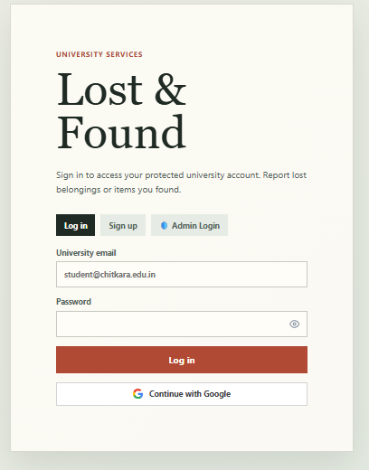

## Student Dashboard

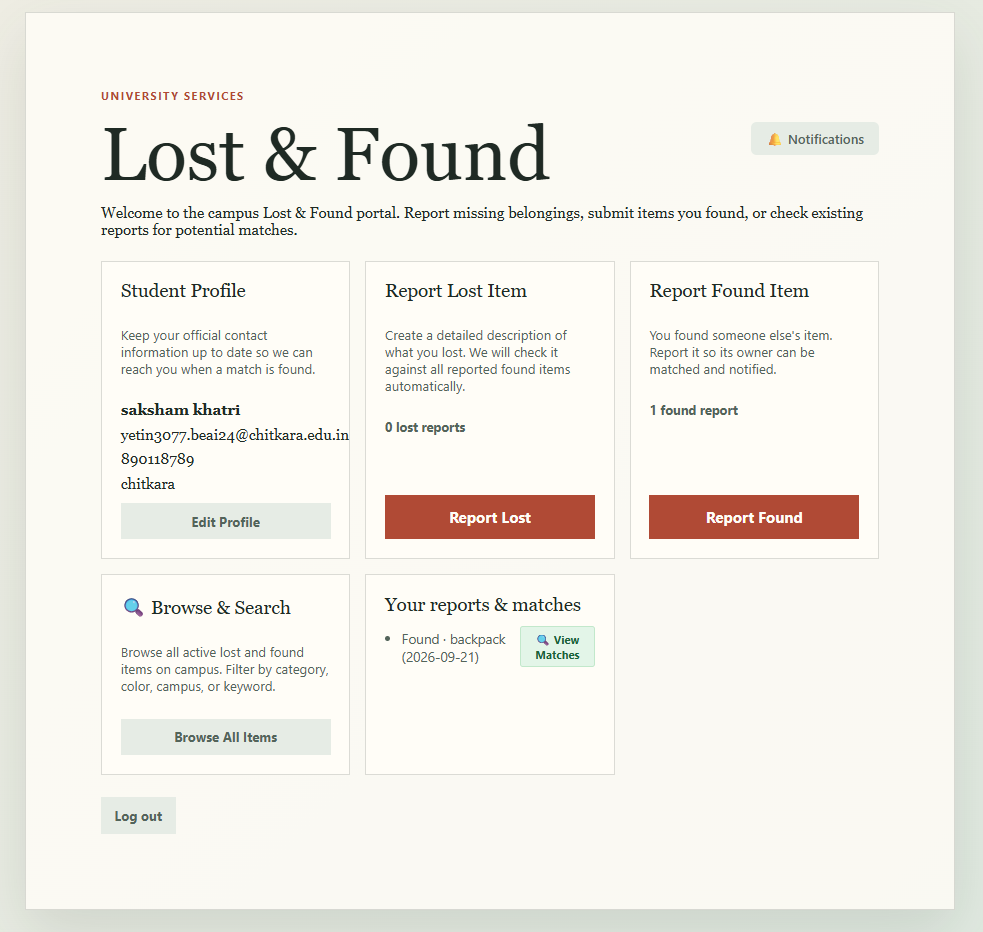

## Report Lost Item

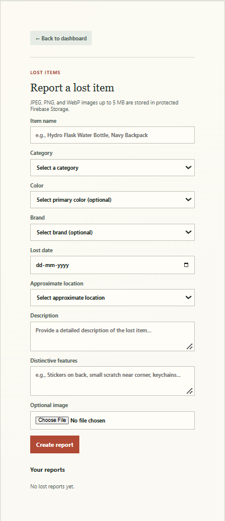

## Report Found Item

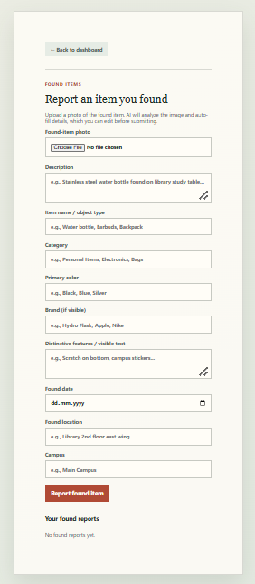

## AI Match Result

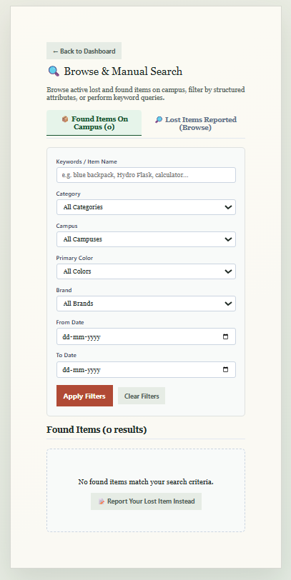

## In-App Notification

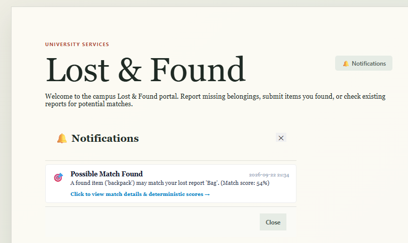

## Email Notification

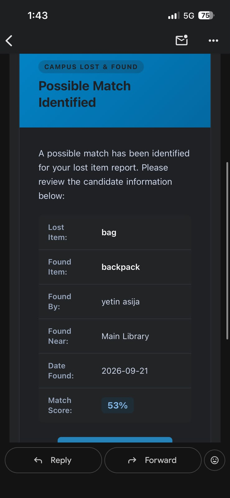

## Match Details

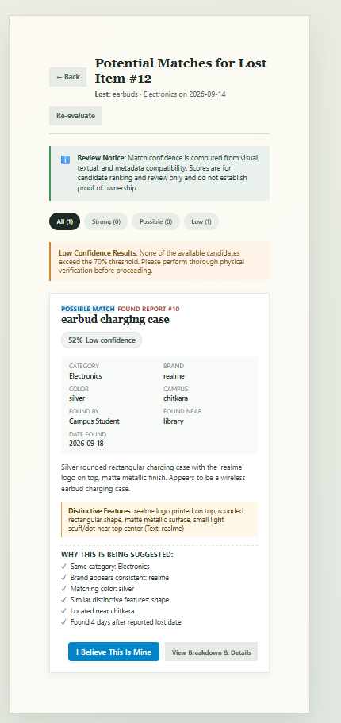

## Claim Submission

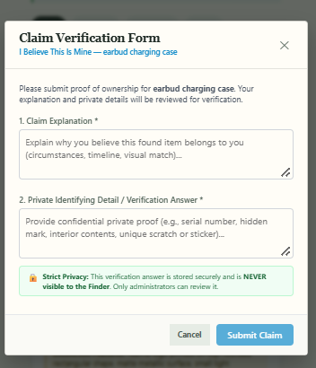

## Admin Claims

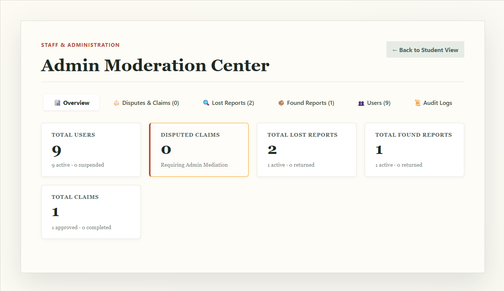

## Approved Claim

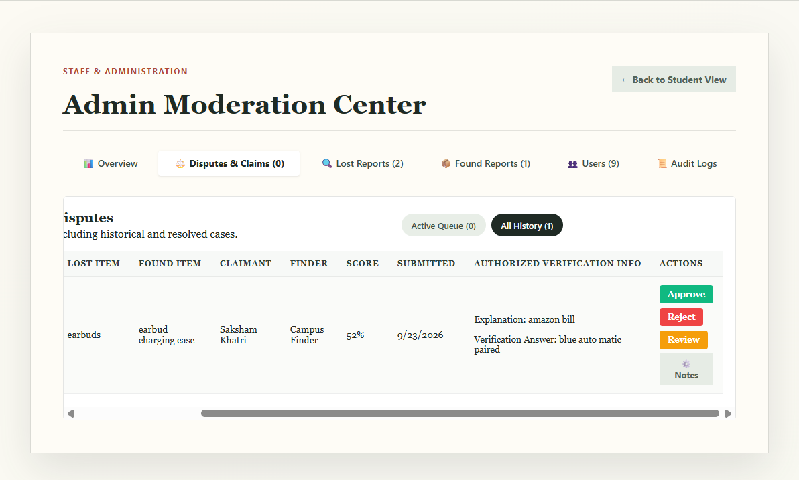

## Closed Match

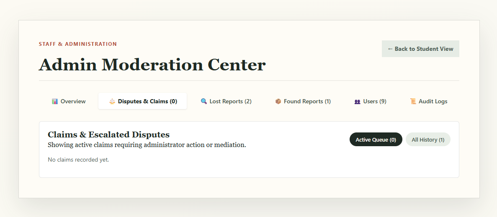

---

# 🎬 Recommended Demo Flow

For a project demonstration:

### Student A

1. Login

2. Report a lost item

3. Upload item details/photo

### Student B

4. Login using a different student account

5. Report the same/similar item as Found

6. Upload a photograph

### System

7. Microsoft AI Foundry analyzes the Found image

8. Attributes are extracted

9. Active Lost Reports are searched

10. Deterministic compatibility scoring runs

11. Match is persisted

12. Lost owner receives in-app notification

13. Lost owner receives email when SMTP is configured

### Lost Owner

14. Open notification

15. Open Match Details

16. See:

```text

Found By: <student name>

```

17. Review score and reasons

18. Select:

```text

I Believe This Is Mine

```

19. Submit claim

### Administrator

20. Open Admin Moderation Center

21. Review claim

22. Review authorized verification information

23. Approve or reject claim

### Resolution

24. Notify the correct users

25. Resolve / return the item

26. Remove the resolved item from active matching

27. Preserve historical match and claim records

---

# 📌 Important Design Rules

## AI does not establish ownership

AI only assists with analysis and candidate generation.

Ownership requires:

```text

AI-assisted Evidence

+

Deterministic Compatibility

+

Human Verification

+

Claim Workflow

```

## Active matching only

Only active Lost and Found records participate in active matching.

## Historical data is preserved

Resolved records are not blindly deleted.

They remain available for:

- Audit

- Reporting

- Historical claims

- Administrative review

## Email is non-blocking

If SMTP is unavailable:

```text

Match creation

    ↓

Still succeeds

In-app notification

    ↓

Still works

Email

    ↓

FAILED / SKIPPED

```

Email failure does not break the core application workflow.

---

# 🎯 Core Workflow Summary

```text

AUTHENTICATION

      ↓

STUDENT PROFILE

      ↓

REPORT LOST

      ↓

REPORT FOUND

      ↓

AI IMAGE ANALYSIS

      ↓

ATTRIBUTE EXTRACTION

      ↓

CANDIDATE RETRIEVAL

      ↓

DETERMINISTIC MATCH SCORE

      ↓

MATCH CREATED

      ↓

┌───────────────┬────────────────┐

│               │                │

▼               ▼                ▼

IN-APP        EMAIL          MATCH DETAILS

ALERT         ALERT               │

                                  ▼

                            FOUND BY NAME

                                  │

                                  ▼

                          OWNERSHIP CLAIM

                                  │

                                  ▼

                           ADMIN REVIEW

                          ┌───────┴───────┐

                          ▼               ▼

                       APPROVE         REJECT

                          │               │

                          ▼               ▼

                     RESOLUTION        CLOSED

                          │

                          ▼

                  ACTIVE MATCH REMOVED

                          │

                          ▼

                    HISTORY PRESERVED

```

---

# ✅ Current Project Status

The current implementation contains the complete AI-assisted Lost & Found workflow, including:

- Firebase authentication

- Student profiles

- Lost reporting

- Found reporting

- Microsoft AI Foundry image analysis

- Candidate retrieval

- Deterministic matching

- In-app notifications

- SMTP email notifications

- Match Details

- Finder display name

- Ownership claims

- Claim lifecycle

- Admin moderation

- Audit/history preservation

- Active-match lifecycle filtering

- Closed/returned item handling

Validation status:

```text

Backend Tests   : 182 passed

Frontend Tests  : 54 passed

Production Build: Passed

Git Diff Check  : Passed

```

---

# 👨‍💻 Project Architecture Principle

The platform intentionally keeps responsibilities separated:

```text

Firebase Authentication

        ↓

Identity

SQLite

        ↓

Application Data

Microsoft AI Foundry

        ↓

AI Analysis

FastAPI

        ↓

Business Logic + Matching + Claims

SMTP

        ↓

Email Notifications

React

        ↓

Student + Admin User Interface

```

The architecture avoids introducing unnecessary databases or microservices for the MVP.

---

# 🔒 Security Reminder

Never commit:

```text

backend/.env

frontend/.env.local

Firebase service-account files

SMTP passwords

Google App Passwords

Microsoft Foundry API keys

Private keys

```

Before pushing:

```powershell

git status

git diff --cached --name-only

```

Verify that no secret file is staged.

---

# 📄 License / Academic Use

This project is developed as a university academic project for a campus-focused Lost & Found system.